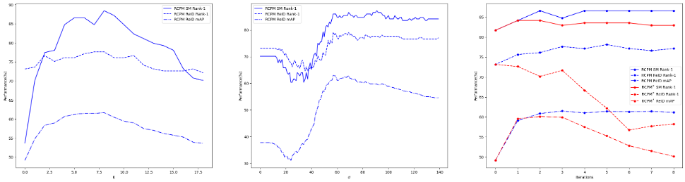

# Figure. 5 in WP-ReID

The official implementation can be found [WP-ReID(Official)](https://github.com/yolomax/WP-ReID)


<div  align="center">
    notebook/Figure5.ipynb
</div>

## Usgage
```shell
$ git clone https://github.com/jangsoopark/WP-ReID
$ cd WP-ReID
$ pip install -e .

$ cd notebook
$ jupyter notebook
```